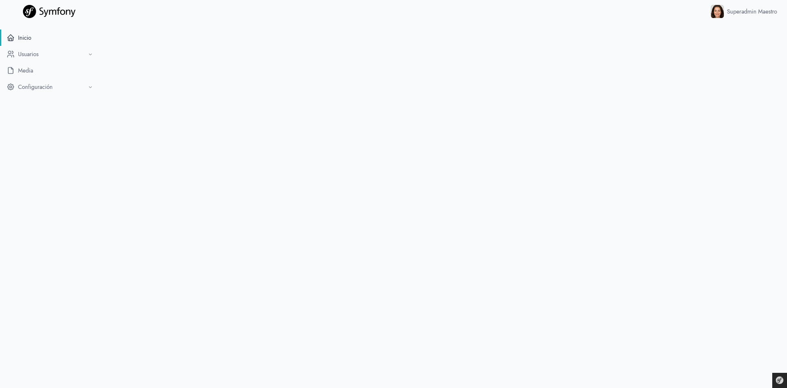
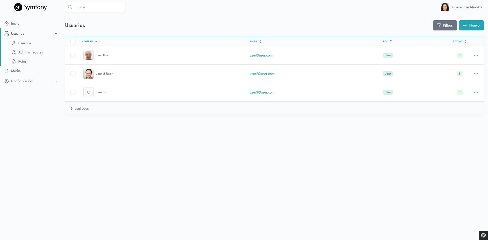
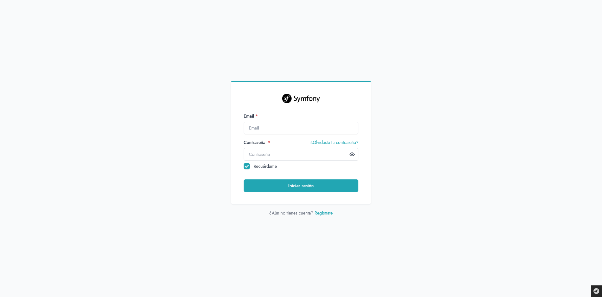
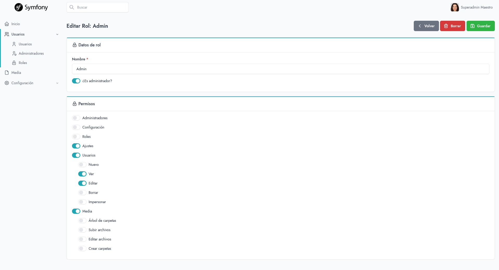

<div align="center">

# Symfony Base

**A reusable Symfony 7.4 + EasyAdmin 4 starter kit for building admin-driven applications.**

[](https://www.php.net)
[](https://symfony.com)
[](https://www.doctrine-project.org)
[](https://github.com/EasyCorp/EasyAdminBundle)
[](https://opensource.org/licenses/MIT)

</div>

> A pragmatic, production-oriented base — **not a framework, not a final application**. Fork it, drop in your domain entities, and ship.

<div align="center">
	
</div>

---

## Table of contents

- [Overview](#overview)
- [Features](#features)
- [Tech stack](#tech-stack)
- [How it extends Symfony / EasyAdmin](#how-it-extends-symfony--easyadmin)
- [Project layout](#project-layout)
- [Getting started](#getting-started)
- [Production deployment](#production-deployment)
- [Optional demo entity](#optional-demo-entity)
- [Documentation](#documentation)
- [Conventions](#conventions)
- [License](#license)

---

## Overview

**Symfony Base** is a starter that bundles the boilerplate every admin-heavy Symfony application ends up rewriting: a permission tree, a configuration model, a custom field catalog, a repository filter system, authentication flows, and a themed EasyAdmin shell.

Everything is built on official Symfony and EasyAdmin components, so upgrades follow the upstream cycle.

## Features

### Admin & UI

- [Tabler](https://github.com/tabler/tabler)-themed EasyAdmin dashboard with locale switcher.
- Shared `AbstractCrudController` with action permission gating and translation helpers.
- Custom field catalog usable both in EasyAdmin and in plain Symfony forms via a single `FieldGenerator` factory.
- Twig components for `User`, `UserAvatar`, `Role`, and `Media`.

<div align="center">
	
</div>

### Security & access control

- Form login, registration, email verification, and password reset.
- Automatic permission tree (per CRUD + per action), edited from a hierarchical UI in the role admin.
- HTTP subscribers for route-level access policies, locale resolution, inactive-user logout, and post-login validation.
- Impersonation built on Symfony `switch_user`.

<div align="center">
	
</div>
<div align="center">
	
</div>

### Frontend

- **Symfony Asset Mapper** (no Webpack/Encore, no Node bundling).
- Stimulus + Turbo, [Tabler](https://github.com/tabler/tabler)/[Bootstrap](https://github.com/twbs/bootstrap), [TomSelect](https://github.com/orchidjs/tom-select), [Flatpickr](https://github.com/flatpickr/flatpickr), [TinyMCE](https://github.com/tinymce/tinymce), [Ace](https://github.com/ajaxorg/ace), [SignaturePad](https://github.com/szimek/signature_pad), [Cropper.js](https://github.com/fengyuanchen/cropperjs), [noUiSlider](https://github.com/leongersen/noUiSlider), [Spectrum](https://github.com/asika32764/spectrum-vanilla), [IMask](https://github.com/uNmAnNeR/imaskjs), [SweetAlert2](https://github.com/sweetalert2/sweetalert2) — all pre-wired through `importmap.php`.

### i18n

- Default locale `es` with `en` ready out of the box.
- Allowed locales driven by the `LOCALES` env var.
- Persistent session locale and EasyAdmin language switcher.

## Tech stack

| Layer         | Stack                                                                      |
| ------------- | -------------------------------------------------------------------------- |
| **Runtime**   | PHP **^8.4**                                                               |
| **Framework** | Symfony **7.4** (Framework, Security, Mailer, Form, Translator, UX)        |
| **Database**  | Doctrine ORM **3.6** · DBAL **4.4** · Migrations **3.9**                   |
| **Admin**     | EasyAdmin **4** · Arkounay UX Media / UX Collection · Artgris File Manager |
| **Auth**      | SymfonyCasts Reset Password & Verify Email                                 |
| **Frontend**  | Asset Mapper · Stimulus · Turbo · Tabler · Bootstrap 5                     |
| **Tooling**   | PHPUnit 12 · PHP-CS-Fixer (`@Symfony`) · Symfony Maker                     |

Exact versions are pinned in [`composer.json`](composer.json), [`composer.lock`](composer.lock), and [`importmap.php`](importmap.php).

## Getting started

### Installation

```bash
git clone <this-repo> my-app
cd my-app
composer install
cp .env .env.local                                    # then edit DATABASE_URL, MAILER_DSN, LOCALES, …
```

### Development setup

For a quick local environment, generate the schema directly from the entity mappings:

```bash
php bin/console doctrine:database:create
php bin/console doctrine:schema:update --force        # dev only — use migrations elsewhere
php bin/console app:create-users
php bin/console app:update-permissions
symfony serve -d                                      # or your local PHP stack
```

`app:create-users` is idempotent and seeds default roles and accounts:

| Email                       | Password     | Role              |
| --------------------------- | ------------ | ----------------- |
| `superadmin@superadmin.com` | `superadmin` | `ROLE_SUPERADMIN` |
| `admin@admin.com`           | `admin`      | `ROLE_ADMIN`      |

> ⚠️ Default credentials are for local bootstrap only. **Rotate them immediately in any shared environment.**

## Production deployment

For any non-local environment, prefer Doctrine Migrations over `schema:update`:

```bash
composer install --no-dev --optimize-autoloader
php bin/console doctrine:migrations:diff              # generate a migration from entity changes
php bin/console doctrine:migrations:migrate --no-interaction
php bin/console app:create-users                      # bootstrap roles only on first deploy
php bin/console app:update-permissions                # update superadmin permissions
php bin/console cache:clear --env=prod
php bin/console asset-map:compile                     # compile Asset Mapper output
```

Recommended environment hardening:

- Generate a real `APP_SECRET` and a non-shared `DATABASE_URL`.
- Configure a real `MAILER_DSN` (defaults to `null://null`).
- Set `REQUIRED_SCHEME=https` (enforced via `security.yaml`).
- Restrict `LOCALES` to the locales you actually translate.
- Replace the seeded users immediately after bootstrap.

## Optional demo entity

A sample entity and CRUD controller are bundled under `docs/Demo/` as `.phps` files. Toggle them on/off with:

```bash
php bin/console app:demo
```

The command swaps files between `docs/Demo/` and `src/`, refreshes the schema, and recomputes superadmin permissions.

## Documentation

Technical documentation organized [by locale](docs/README.md).

| Topic                                                | Page                                               |
| ---------------------------------------------------- | -------------------------------------------------- |
| Getting started, environment, console seeding        | [01-getting-started.md](docs/en/01-getting-started.md)   |
| Architecture overview                                | [02-architecture.md](docs/en/02-architecture.md)         |
| Configuration system (Config + AppConfig + cache)    | [03-configuration.md](docs/en/03-configuration.md)       |
| Authentication, registration, reset password         | [04-authentication.md](docs/en/04-authentication.md)     |
| Roles, permission tree, virtual permissions          | [05-permissions.md](docs/en/05-permissions.md)           |
| HTTP event subscribers                               | [06-http-subscribers.md](docs/en/06-http-subscribers.md) |
| EasyAdmin layer (Dashboard + AbstractCrudController) | [07-easyadmin.md](docs/en/07-easyadmin.md)               |
| Custom fields and `FieldGenerator`                   | [08-fields.md](docs/en/08-fields.md)                     |
| Forms (`FormGenerator`, public auth forms)           | [09-forms.md](docs/en/09-forms.md)                       |
| Repositories and composable filters                  | [10-repositories.md](docs/en/10-repositories.md)         |
| Twig extensions and Live Components                  | [11-twig.md](docs/en/11-twig.md)                         |
| Templates and bundle overrides                       | [12-templates.md](docs/en/12-templates.md)               |
| Frontend assets and Asset Mapper                     | [13-assets.md](docs/en/13-assets.md)                     |
| Email (`MailService`, transactional templates)       | [14-email.md](docs/en/14-email.md)                       |
| Internationalization                                 | [15-i18n.md](docs/en/15-i18n.md)                         |
| Console commands                                     | [16-console.md](docs/en/16-console.md)                   |

## Conventions

- **Style** — PHP-CS-Fixer ruleset `@Symfony` with `yoda_style = false`. See [`.php-cs-fixer.dist.php`](.php-cs-fixer.dist.php).
- **Locale** — default `es`. See [`config/packages/translation.yaml`](config/packages/translation.yaml).
- **Tests** — PHPUnit 12; configuration in [`phpunit.dist.xml`](phpunit.dist.xml).

## License

MIT (see [`composer.json`](composer.json)). Adjust to your needs before publishing.
